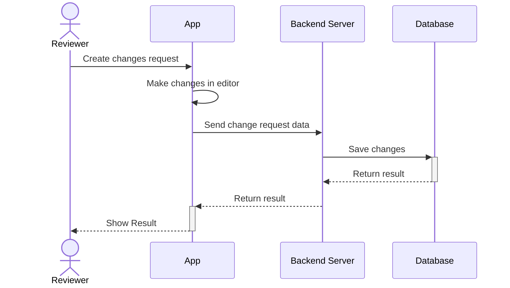

# Request contract changes

```mermaid
sequenceDiagram
    actor Reviewer as Reviewer
    participant App as App
    participant Server as Backend Server
    participant DB as Database

    Reviewer ->> App: Create changes request
    App ->> App: Make changes in editor
    App ->> Server: Send change request data
    Server ->>+ DB: Save changes
    DB -->>- Server: Return result
    Server -->>+ App: Return result
    App -->>- Reviewer: Show Result
```

