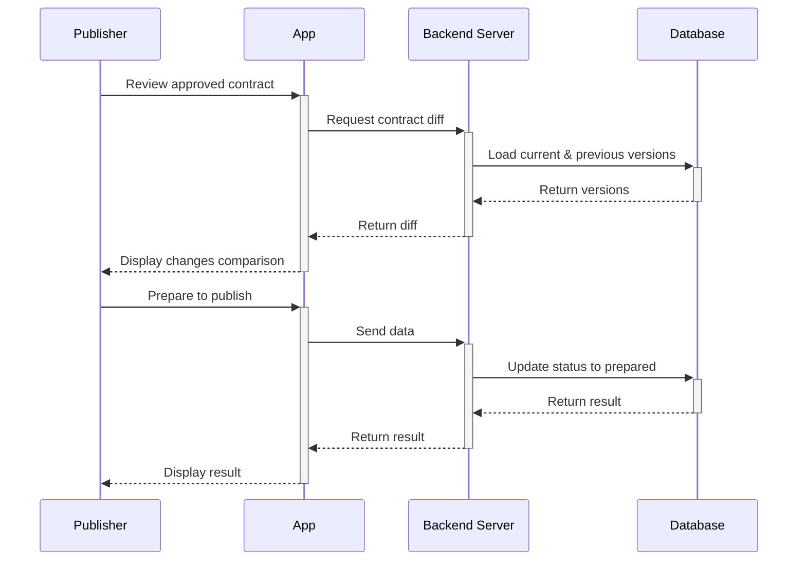

# Pre-Publish contract to CDN

Before publisher can publish a contract, they must view diff
between changed version and previos version.

```mermaid
sequenceDiagram
    participant Pub as Publisher
    participant App as App
    participant Server as Backend Server
    participant DB as Database

    Pub ->>+ App: Review approved contract
    App ->>+ Server: Request contract diff

    Server ->>+ DB: Load current & previous versions
    DB -->>- Server: Return versions

    Server -->>- App: Return diff
    App -->>- Pub: Display changes comparison

    Pub ->>+ App: Prepare to publish
    App ->>+ Server: Send data

    Server ->>+ DB: Update status to prepared
    DB -->>- Server: Return result

    Server -->>- App: Return result
    App -->>- Pub: Display result
```
