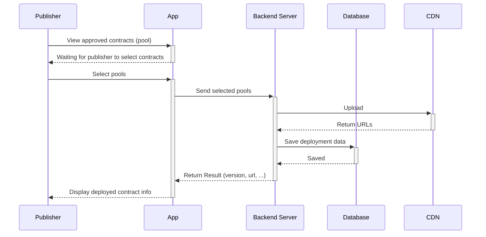

# Publish contract to CDN

```mermaid
sequenceDiagram
      participant Pub as Publisher
      participant App as App
      participant Server as Backend Server
      participant DB as Database
      participant CDN as CDN
      
      Pub ->>+ App: View approved contracts (pool)
      App -->>- Pub: Waiting for publisher to select contracts

      Pub ->>+ App: Select pools
      App ->>+ Server: Send selected pools

      Server ->>+ CDN: Upload
      CDN -->>- Server: Return URLs

      Server ->>+ DB: Save deployment data
      DB -->>- Server: Saved

      Server -->>- App: Return Result (version, url, ...)
      App -->>- Pub: Display deployed contract info
```
