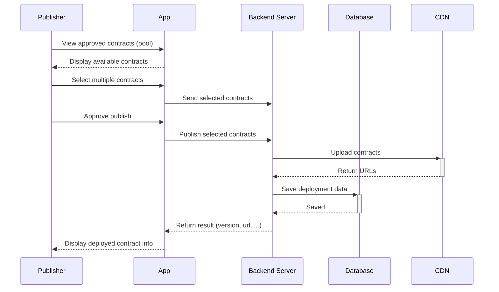

# Publish contract to CDN

```mermaid
sequenceDiagram
      participant Pub as Publisher
      participant App as App
      participant Server as Backend Server
      participant DB as Database
      participant CDN as CDN
      
      Pub ->> App: View approved contracts (pool)
      App -->> Pub: Display available contracts

      Pub ->> App: Select multiple contracts
      App ->> Server: Send selected contracts

      Pub ->> App: Approve publish
      App ->> Server: Publish selected contracts

      Server ->>+ CDN: Upload contracts
      CDN -->>- Server: Return URLs

      Server ->>+ DB: Save deployment data
      DB -->>- Server: Saved

      Server -->> App: Return result (version, url, ...)
      App -->> Pub: Display deployed contract info
```
