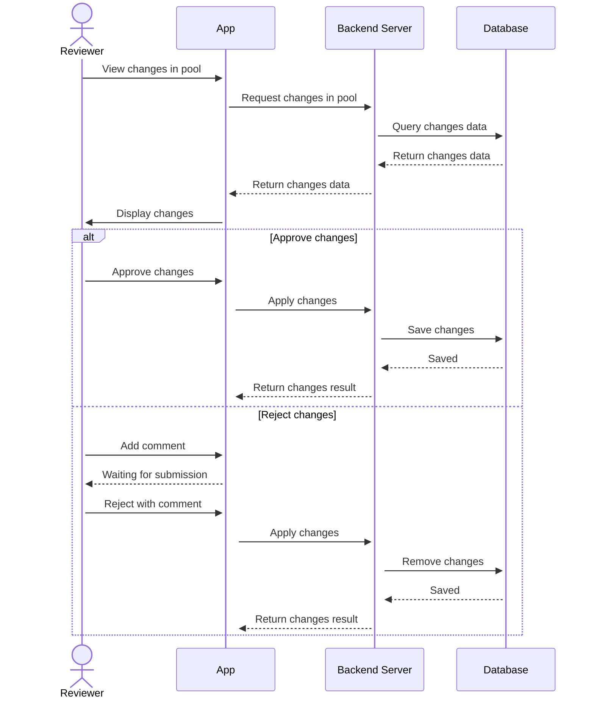

```mermaid
sequenceDiagram
      actor Reviewer as Reviewer
      participant App as App
      participant Server as Backend Server
      participant DB as Database

      Reviewer ->>+ App: View changes in pool
      App ->>+ Server: Request changes in pool
      Server ->>+ DB: Query changes data
      DB -->> Server: Return changes data
      Server -->>+ App: Return changes data
      App ->>+ Reviewer: Display changes
    alt Approve changes
        Reviewer ->>+ App: Approve changes
        App ->>+ Server: Apply changes
        Server ->>+ DB: Save changes
        DB -->> Server: Saved
        Server -->> App: Return changes result
      else Reject changes
        Reviewer ->>+ App: Add comment
        App -->> Reviewer: Waiting for submission
        Reviewer ->> App: Reject with comment
        App ->>+ Server: Apply changes
        Server ->>+ DB: Remove changes
        DB -->> Server: Saved
        Server -->> App: Return changes result
    end
```
