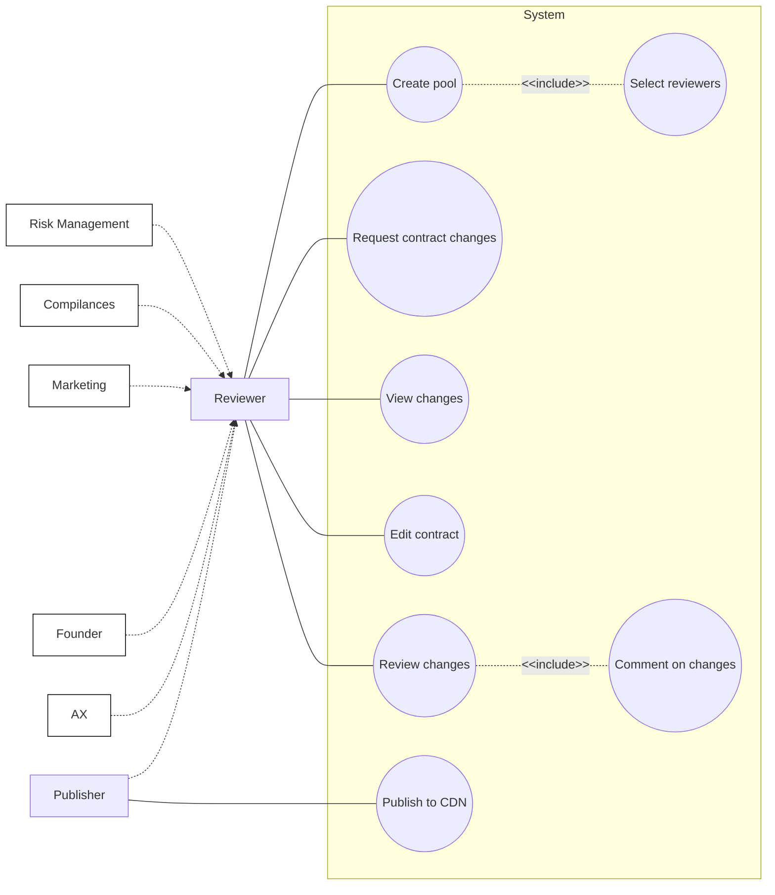

```mermaid
flowchart LR
 subgraph System["System"]
        UC0(("Create pool"))
        UC1(("Request contract changes"))
        UC2(("Select reviewers"))
        UC3(("Edit contract"))
        UC4(("Comment on changes"))
        UC5(("View changes"))
        UC6(("Publish to CDN"))
        UC7(("Review changes"))
  end
    Risk["Risk Management"] -.-> Re["Reviewer"]
    Co["Compilances"] -.-> Re
    Market["Marketing"] -.-> Re
    Founder["Founder"] -.-> Re
    AX["AX"] -.-> Re
    Publisher["Publisher"] -.-> Re
    Publisher --- UC6
    
    Re --- UC0 & UC1 & UC5 & UC3 & UC7
    UC0 -. &lt;&lt;include&gt;&gt; .- UC2
    UC7 -. &lt;&lt;include&gt;&gt; .- UC4

    style Risk stroke:#000000,fill:transparent,stroke-width:1px,stroke-dasharray: 0
    style Co stroke:#000000,fill:transparent,stroke-width:1px,stroke-dasharray: 0
    style Market stroke:#000000,fill:transparent,stroke-width:1px,stroke-dasharray: 0
    style Founder stroke:#000000,fill:transparent,stroke-width:1px,stroke-dasharray: 0
    style AX stroke:#000000,fill:transparent,stroke-width:1px,stroke-dasharray: 0
```
