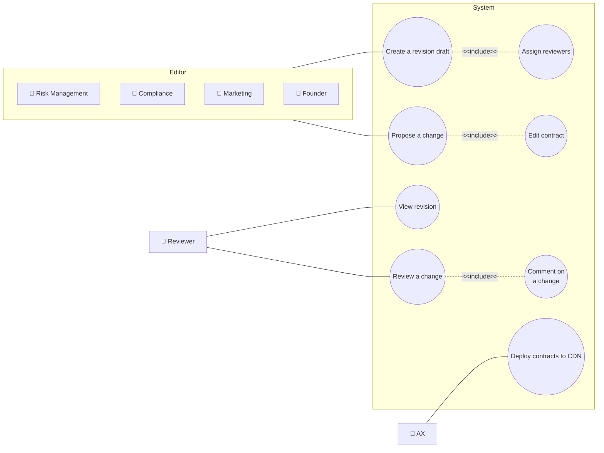

# Usecase

```mermaid
flowchart LR
 subgraph System["System"]
        UC0(("Create a revision draft"))
        UC1(("Propose a change"))
        UC2(("Assign reviewers"))
        UC3(("Edit contract"))
        UC4(("Comment on\na change"))
        UC5(("View revision"))
        UC6(("Deploy contracts to CDN"))
        UC7(("Review a change"))
  end
 subgraph Editor["Editor"]
        Risk["👤 Risk Management"]
        Co["👤 Compliance"]
        Market["👤 Marketing"]
        Founder["👤 Founder"]
  end
    Editor --- UC0  & UC1
    Re["👤 Reviewer"] --- UC5 & UC7
    AX["👤 AX"] --- UC6
    UC0 -. &lt;&lt;include>> .- UC2
    UC1 -. &lt;&lt;include>> .- UC3
    UC7 -. &lt;&lt;include>> .- UC4
```
